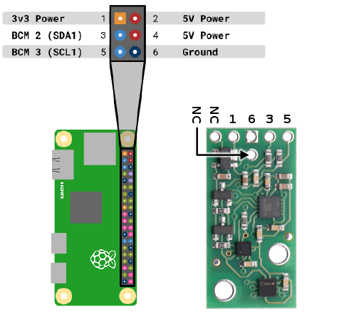
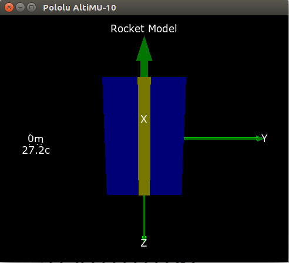

# README #

This project intends to implement an on-board camera and an IMU for model rocketry. The video and
IMU data are streamed from the RPi to the receiver, which is coded for a machine running Linux.

Gstreamer decodes and shows the video data sent from the RPi. A Python script retrieves the IMU,
altitude and temperature data. They are conveniently displayed in a 3D-model as shown below.

It works with the following hardware:

* Raspberry Pi Zero W (external WiFi adaptor should also be supported)
* AltiMU-10 v5 (previous versions may work adding support to older altimeters)
* Raspberry Pi Camera Module V2

For further details regarding design and implementation: [hackster.io project](https://www.hackster.io/gleisonstorto/video-imu-from-model-rocket-to-base-station-gui-via-wifi-3956c6)

### Acknowledgements ###

This work would not be possible without the following contributions:

* RaspberryPi application project, most notably [Raspicam](https://github.com/raspberrypi/userland/tree/master/host_applications/linux/apps/raspicam) 
* [minimu9-ahrs project](https://github.com/DavidEGrayson/minimu9-ahrs) by David E Grayson
* [minimu-9-ahrs-arduino project](https://github.com/pololu/minimu-9-ahrs-arduino) by Pololu
* [contributions from cpunk](https://www.raspberrypi.org/forums/viewtopic.php?f=43&t=200251) on RaspberryPi forums
* [contributions from Mark Setchell](https://stackoverflow.com/questions/47862066/streaming-video-using-a-non-blocking-fifo-in-linux-bash) on StackOverflow

### Quick start ###

The first thing to do is connect your RPi Zero to the camera module and the I2C pins to the AltiMU-10.
These are the pinouts to be connected, supposing SA0 does not need to be driven (single AltiMU):



Before launching the main script, you may need to redefine the variables remote_ip, local_ip,
altimu_port and video_port to match your network parameters in launch.bash.

The script launch.bash should open all processes both in local and remote machines. I always launch
the script using the bash -x command to ease the debug. There are also log files for every
executed binary in both machines.

Available files:

```
* altimu*.tsv -> payload from altiMU-10 board       (local and remote)
* video*.h264 -> h264 video from raspivid binary    (remote)
* *.log       -> log files for each executed binary (local and remote)
```

The tsv file is structured as follows:

```
timestamp  yaw  pitch  roll  acc_x  acc_y  acc_z  mag_x  mag_y  mag_z  altitude  temperature
```

With the following remarks:

* timestamp in seconds
* altitude relative to 1013.25hPa pressure (MSL)
* temperature in celsius

### Overview ###

The informations from the IMU are displayed as follows:



Video sent from the RPi Camera is shown in 720p resolution to reduce workspace usage.
Should you desire to change the resolution, in launch.bash the following line has to be edited:

```
gst-launch-1.0 udpsrc udp://0.0.0.0:$video_port ! h264parse ! avdec_h264 ! videoconvert ! \
	       videoscale ! video/x-raw,width=1280,height=720 ! autovideosink sync=false &> \
               $gst_log &
```

At 720p, a sample video is displayed as such:

